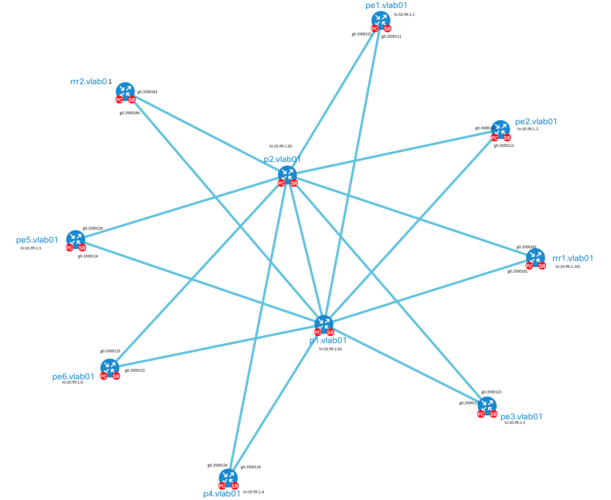

# MPLS Backbone Automation Lab

A historical OpenDaylight RESTCONF lab reference that shows how to build an MPLS backbone on Cisco IOS XRv routers through a Postman workflow.

This repository packages a 2018 proof-of-concept lab into a public reference asset. The original lab used OpenDaylight (ODL) as a controller and NETCONF/RESTCONF as the management plane to configure a multi-router MPLS backbone. The preserved Postman collection shows the step-by-step API workflow used to create QoS policy, Layer 3 interfaces, OSPF, LDP, MPLS Traffic Engineering, RSVP, and BGP address-family activation.



## Value Proposition

This proof of concept helps network automation audiences see how a controller-driven workflow can assemble a complete transport backbone without relying on manual device CLI sessions. It is useful as:

- A guided walkthrough of model-driven network configuration using RESTCONF.
- A reference for sequencing backbone build tasks across provider-edge, provider-core, and route-reflector roles.
- A historical example of early practical network automation patterns from a 2018 MPLS lab.
- A conversation starter for comparing API collections, service models, and modern network automation pipelines.

## Use Cases For Programmatic Infrastructure Builds

Programmatically building infrastructure is useful when teams need repeatable, auditable, and faster deployment workflows. This lab shows several practical use cases:

- Repeatable lab provisioning: rebuild the same MPLS backbone topology consistently for training, testing, examples, or validation.
- Controller-driven network configuration: use a central controller and RESTCONF APIs to apply configuration across multiple routers instead of logging into each device manually.
- Backbone service turn-up: sequence core transport features such as interfaces, OSPF, LDP, MPLS Traffic Engineering, RSVP, and BGP in a controlled workflow.
- Configuration standardization: apply common QoS, routing, MPLS, and BGP patterns across provider, provider-edge, and route-reflector nodes.
- Change validation and verification: pair configuration requests with `GET` requests that confirm intended state or inspect operational data after each major step.
- Enablement workflows: give engineers, architects, and technical sellers a concrete example of how network infrastructure can be built through APIs.
- Automation pipeline prototyping: use the Postman workflow as a starting point before migrating the same logic into CI/CD, Ansible, NSO, Terraform, Python, or another automation platform.
- Disaster recovery rehearsal: practice rebuilding known-good infrastructure state in a disposable lab using documented, repeatable API calls.
- Golden configuration testing: validate routing, MPLS, QoS, and traffic-engineering configuration patterns before adapting them to production automation.
- Historical automation reference: preserve an example of early model-driven network automation using OpenDaylight, NETCONF, RESTCONF, and vendor YANG models.

## Audience

The lab is intended for network engineers, automation engineers, architects, and technical sellers who want to explain or inspect how a controller can coordinate backbone configuration across IOS XRv nodes. It assumes familiarity with routing protocols and basic API tooling, but it does not assume prior knowledge of the original 2018 lab.

## Background And History

The original proof of concept was built in 2018 to show how OpenDaylight could use mounted NETCONF devices and vendor YANG models to automate an MPLS backbone. The collection reflects the tools and naming conventions of that period, including direct RESTCONF paths into mounted IOS XRv nodes.

This release keeps the historically useful workflow intact while removing committed credentials, replacing environment-specific controller addresses with variables, and adding enough documentation for an audience to review the configuration sequence.

## Repository Contents

- `POC-02-BuildaMPLSBackbone.postman_collection.json`: Postman collection containing the ordered RESTCONF workflow.
- `Backbone-l3-topology.png`: Original topology diagram from the lab.
- `SECURITY.md`: Security reporting and credential-handling guidance.

## Architecture And Workflow Overview

The lab follows a controller-mediated workflow:

1. Postman sends RESTCONF API calls to OpenDaylight.
2. OpenDaylight exposes mounted IOS XRv nodes under the NETCONF topology.
3. Each collection task targets a router role such as `p1`, `p2`, `pe1` through `pe6`, `rrr1`, or `rrr2`.
4. The workflow progressively builds the backbone: QoS, interfaces, IGP, label distribution, traffic engineering, RSVP, then BGP.
5. Verification requests read selected config and operational data back through RESTCONF.

At a design-pattern level, the repository is similar in spirit to other controller or orchestrator workflows such as Cisco NSO service packages, Ansible playbooks, or modern API-driven network pipelines: a repeatable workflow describes intended network state and applies it through a central automation surface. This lab is not an NSO or Ansible implementation; it is a Postman/ODL example of the same broader automation pattern.

## Config Review Flow

1. Open the topology diagram and explain the router roles:
   - `p1` and `p2`: provider core routers.
   - `pe1` through `pe6`: provider edge routers.
   - `rrr1` and `rrr2`: route reflector routers.
2. Import the Postman collection.
3. Configure local Postman variables for the controller and credentials.
4. Run or review the tasks in order:
   - Task 1: Create QoS policies.
   - Task 2: Create Layer 3 interfaces.
   - Task 3: Enable OSPF.
   - Task 4: Enable LDP.
   - Task 5: Enable MPLS TE.
   - Task 6: Enable RSVP.
   - Task 7: Enable BGP and activate AFIs/SAFIs.
5. Use the included `GET` requests to inspect configuration or operational state after major milestones.
6. Use `DELETE` requests only in a disposable lab when you intentionally want to remove example configuration.

## Prerequisites

- Postman or a compatible collection runner.
- An OpenDaylight controller with RESTCONF enabled.
- IOS XRv routers mounted in OpenDaylight through NETCONF using the node names expected by the collection:
  - `p1.vlab01`
  - `p2.vlab01`
  - `pe1.vlab01` through `pe6.vlab01`
  - `rrr1.vlab01`
  - `rrr2.vlab01`
- Lab credentials stored locally in Postman, not committed to this repository.
- A disposable lab environment. Several requests modify routing, MPLS, RSVP, BGP, interface, and QoS configuration.

## Postman Variables

Set these values in a local Postman environment or override the collection variables before running the lab:

| Variable | Purpose |
| --- | --- |
| `odl-02-cfg-nc` | RESTCONF config datastore base URL for mounted NETCONF nodes. |
| `odl-02-oper-nc` | RESTCONF operational datastore base URL for mounted NETCONF nodes. |
| `odl_username` | OpenDaylight RESTCONF username. |
| `odl_password` | OpenDaylight RESTCONF password. |
| `bgp_neighbor_password` | Optional BGP neighbor password used by route-reflector neighbor-group requests. |
| `ospf_md5_password` | Optional OSPF MD5 authentication password used by OSPF task requests. |
| `bgp_rr_neighbor_password` | Optional BGP password used by PE-to-route-reflector neighbor-group requests. |

Example URL shape:

```text
http://<odl-controller>:8181/restconf/config/network-topology:network-topology/topology/topology-netconf/node
```

## Sanitization Notes

- Committed literal Basic auth headers were removed from the collection and replaced with collection-level variable-based Basic auth.
- Historical protocol password values were replaced with `{{bgp_neighbor_password}}`, `{{bgp_rr_neighbor_password}}`, and `{{ospf_md5_password}}`.
- Hard-coded OpenDaylight controller URLs were replaced with collection variables.
- The original topology image is retained to preserve lab context. Confirm ownership or redistribution rights before publishing the repository publicly.
- Lab IP addressing and hostnames are retained as documentation of the reference topology. They appear to be private or documentation-style lab identifiers, not public production infrastructure.
- No `.env` files, private keys, packet captures, logs, datasets, or binaries are included in this working tree.

## Private Lab Replacement Notes

Before adapting the collection, replace OpenDaylight endpoint variables,
RESTCONF credentials, optional BGP and OSPF passwords, mounted-node names,
router hostnames, topology addressing, and any route policy values that must
match the private lab.

## Safety Notes

Run this collection only against a disposable lab. The collection includes `PUT`, `POST`, and `DELETE` requests that can create, alter, or remove network configuration. Review each task before running it against any controller with access to real devices.
